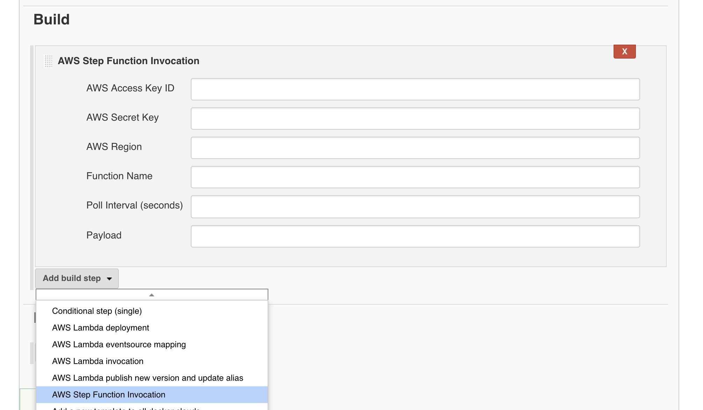

# aws-stepfunctions-plugin

A Jenkins plugin that invokes an AWS Step Function, and prints the output.

## Running locally

```
    export MAVEN_OPTS="-Xdebug -Xrunjdwp:transport=dt_socket,server=y,address=8888,suspend=n"
    mvn hpi:run
```
## Usage in Jenkins Builds

Select the "AWS Step Function Invocation" step displayed below, and fill out the required parameters.


